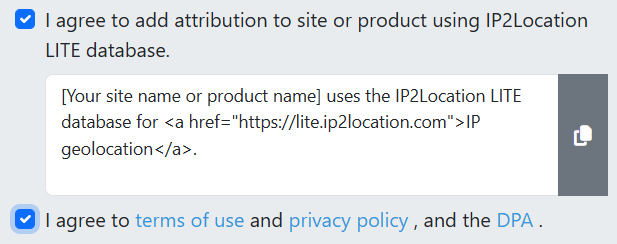

# Updating IP to Location Tables

The bash-scripts folder contains shell scripts (written in bash) to update the tables that
contain IP address to geographical location information.  These shell scripts have been tested
in the cygwin environment (bash window) on Windows.  They may also run in the Linux subsystem on
Windows (or on native Linux proper), but that has not been tested.  They may not run in the
git bash shell window since that has a limited fixed set of utility programs.  The names of the
shell scripts of interest all start with `ip2location-step`.  The scripts named `tab2sql-*` are
obsolete and only of historical interest (if that).

## Preconditions

1. Install cygwin.  This can be downloaded from https://www.cygwin.com/.  You need to make sure
the `flip` package is installed for cygwin.  The `unzip` package may also be useful.

2. Install postgreSQL in order to get `psql`.  This can be downloaded from
https://www.enterprisedb.com/downloads/postgres-postgresql-downloads.  I'm not sure that the
version matters too much.  (The update in June 2025 used version 17.5, the newest at that point
in time.)

3. Add the path to the folder containing psql.exe to the PATH variable in your environment.  For
postgreSQL 17.5, this path was `C:\Program Files\PostgreSQL\17\bin`.

## Obtaining the Data

The raw data for updating the tables is found at https://lite.ip2location.com/database-download.
This site requires a (free) login to access.  Getting an account requires an agreement to give
attribution.   
Bloom library gives this attribution on the various stats pages such as
https://bloomlibrary.org/stats/locations-country-map.

We want three files from the IP2Location Database.
* the CSV file for IP-COUNTRY from the IPv4 Database.
* the CSV file for IP-COUNTRY-REGION-CITY from the IPv4 Database.
* the CSV file for IP-COUNTRY-REGION-CITY from the IPv6 Database.

These are downloaded in zip archive format.  Create a folder named downloads in the bash-scripts
folder.  Move the downloaded files to that new folder and unzip them.  (The zip files can be
deleted after this step, along with any readme or license files.)  Only the CSV files are needed
for updating the database tables.  Assuming their names haven't changed, these are named
* IP2LOCATION-LITE-DB1.CSV
* IP2LOCATION-LITE-DB3.CSV
* IP2LOCATION-LITE-DB3.IPV6.CSV

Note that these files are rather large, especially the last two.  The June 2025 downloads were
16MB, 219MB, and 552MB respectively.  That's more than three quarters of a gigabyte in the CSV
form, which may be smaller than the data representation in the database.

## Updating the Database Tables

In the cygwin bash window, go to the `bash-scripts` folder and execute the step 1 script, first
ensuring that line endings are compatible with bash:
```
cd bash-scripts
flip -u ip2location-step1-uploadNewData.sh
./ip2location-step1-uploadNewData.sh
```
This operation will take a few minutes, creating new database tables named something like
`ip2location_as_of_2025_06_30`, `ipv42location_as_of_2025_06_30`, and
`ipv62location_as_of_2025_06_30`.  These date-stamped tables contain all the data from the CSV
files.  A temporary file named `temp_psqlHelperCommands.txt` is created in the `bash-scripts`
folder by this process.  This can be deleted after everything is done.

Note: in August 2025, we needed to free up disk space for the database. We backed up the existing historical IP2Location tables in [Drive](https://drive.google.com/drive/u/0/folders/1cqIgr7foM8Q31msfSH6t3v-kZ0cKoCXw) and deleted the tables.

Once the first script finishes, you can run the second script to generate a temporary script
to actually update the real tables.  (First ensure that line ending are compatible with bash.)
```
flip -u ip2location-step2-createUpdateCommands.sh
./ip2location-step2-createUpdateCommands.sh
```
This command creates another temporary file in the `bash-scripts` folder named
`temp_psqlUpdateCommands.txt` which is used by a following step.  It should take only a second or so to run.

At this point, you need to go to the Segment control dashboard and disable syncing to the azure
postgreSQL database.  **[TODO: Andrew can fill in the details about this step?]**

After ensuring that Segment won't be forwarding data and trying to use the ip2location tables,
run the second script to actually update the tables:
```
./ip2location-step2-createUpdateCommands.sh --execute
```
This form of the command uses the SQL script file created in the prior step
(`temp_psqlUpdateCommands.txt`) to update the working tables in the database.  It will take
several minutes to run.

After the successful completion of this final script, the syncing from Segment to the Azure
postgreSQL database can be resumed.  **[TODO: Andrew can fill in the details about this step?]**

## Troubleshooting

During the final bash script to update the working tables in June 2025, updating the final table
was aborted with the error messages
```
psql:.../temp_psqlUpdateCommands.txt:5: FATAL: terminating connection due to administrator command
psql:.../temp_psqlUpdateCommands.txt:5: SSL connection has been closed unexpectedly
psql:.../temp_psqlUpdateCommands.txt:5: error: connection to server was lost
```
After that happened, trying to rerun the script kept producing error messages like these:
```
psql:.../temp_psqlUpdateCommands.txt:4: ERROR:  cannot execute DELETE in a read-only transaction
psql:.../temp_psqlUpdateCommands.txt:5: ERROR:  cannot execute INSERT in a read-only transaction
psql:.../temp_psqlUpdateCommands.txt:7: ERROR:  cannot execute DELETE in a read-only transaction
psql:.../temp_psqlUpdateCommands.txt:8: ERROR:  cannot execute INSERT in a read-only transaction
```
After investigation, we determined that the problem was running out of disk space for the Azure
postgreSQL database.  We were hard up against the 64GB allowed, and postgreSQL automatically
makes the database read-only when getting too close to the limit.  After discovering this by
way of online searching, we were able to take steps to get the data loaded.
